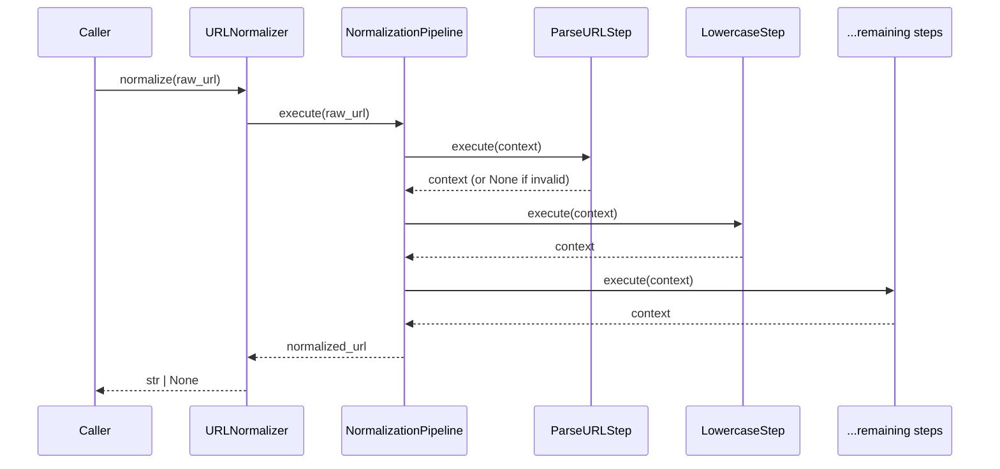
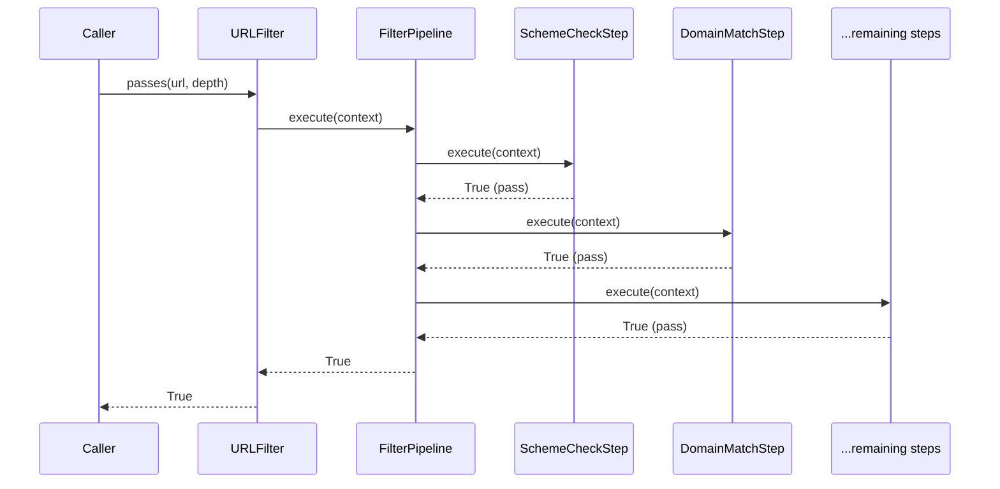
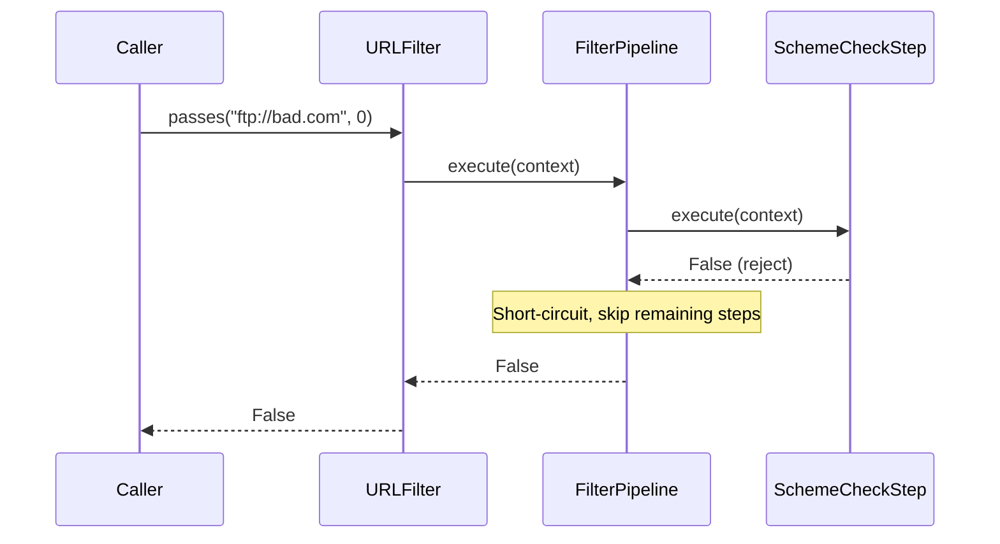

# Design Document: URL Pipeline Refactor

## Overview

This refactoring transforms the monolithic `URLNormalizer.normalize()` and `URLFilter.passes()` methods into composable, object-oriented pipelines where each processing step is a small, focused class. Steps are configured via a YAML file that controls which steps are active and their parameters.

The public API (`URLNormalizer.normalize()` and `URLFilter.passes()`) remains unchanged — existing callers and tests continue to work without modification. The internal architecture shifts from sequential procedural code to a chain-of-responsibility pattern with individually testable step classes.

This enables adding, removing, or reordering steps without modifying core pipeline logic, and makes each step independently testable and reusable.

## Architecture

```mermaid
graph TD
    subgraph Public API (unchanged)
        UN[URLNormalizer.normalize]
        UF[URLFilter.passes]
    end

    subgraph Pipeline Infrastructure
        NP[NormalizationPipeline]
        FP[FilterPipeline]
        YL[YAMLConfigLoader]
    end

    subgraph Normalization Steps
        NS1[ParseURLStep]
        NS2[LowercaseStep]
        NS3[RemoveDefaultPortStep]
        NS4[RemoveFragmentStep]
        NS5[SortQueryParamsStep]
        NS6[UppercasePercentEncodingStep]
        NS7[DecodeUnreservedStep]
        NS8[TrailingSlashStep]
    end

    subgraph Filter Steps
        FS1[SchemeCheckStep]
        FS2[DomainMatchStep]
        FS3[DepthCheckStep]
        FS4[ExcludePatternStep]
        FS5[IncludePatternStep]
        FS6[DeduplicationStep]
    end

    UN --> NP
    UF --> FP
    YL --> NP
    YL --> FP
    NP --> NS1 --> NS2 --> NS3 --> NS4 --> NS5 --> NS6 --> NS7 --> NS8
    FP --> FS1 --> FS2 --> FS3 --> FS4 --> FS5 --> FS6
```

## Sequence Diagrams

### Normalization Flow



### Filter Flow



### Filter Short-Circuit



## Components and Interfaces

### Abstract Base: NormalizationStep

**Purpose**: Defines the contract for a single URL normalization transformation.

```python
from abc import ABC, abstractmethod
from dataclasses import dataclass, field
from typing import Optional
from urllib.parse import ParseResult


@dataclass
class NormalizationContext:
    """Mutable context passed through the normalization pipeline."""
    raw_url: str
    parsed: Optional[ParseResult] = None
    scheme: str = ""
    host: str = ""
    port: Optional[int] = None
    path: str = ""
    query: str = ""
    # Steps can set this to signal the URL is invalid
    rejected: bool = False


class NormalizationStep(ABC):
    """Abstract base for a single normalization step."""

    @abstractmethod
    def execute(self, ctx: NormalizationContext) -> NormalizationContext:
        """Transform the context in-place. Set ctx.rejected=True to abort."""
        ...

    @property
    @abstractmethod
    def name(self) -> str:
        """Unique identifier for this step (used in YAML config)."""
        ...
```

**Responsibilities**:
- Define a uniform interface for all normalization steps
- Carry a `name` property for config-based enable/disable

### Abstract Base: FilterStep

**Purpose**: Defines the contract for a single URL filter check.

```python
from abc import ABC, abstractmethod
from dataclasses import dataclass
from typing import Optional
from urllib.parse import ParseResult


@dataclass
class FilterContext:
    """Immutable-ish context passed through the filter pipeline."""
    url: str
    parsed: ParseResult
    depth: int
    seed_domain: str
    max_depth: Optional[int]
    include_patterns: list[str]
    exclude_patterns: list[str]
    store: object  # MetadataStore


class FilterStep(ABC):
    """Abstract base for a single filter check."""

    @abstractmethod
    def execute(self, ctx: FilterContext) -> bool:
        """Return True if URL passes this check, False to reject."""
        ...

    @property
    @abstractmethod
    def name(self) -> str:
        """Unique identifier for this step (used in YAML config)."""
        ...
```

**Responsibilities**:
- Define a uniform interface for all filter steps
- Return a boolean pass/reject decision
- Support short-circuit evaluation

### NormalizationPipeline

**Purpose**: Composes normalization steps into an ordered chain.

```python
class NormalizationPipeline:
    """Executes an ordered list of NormalizationStep instances."""

    def __init__(self, steps: list[NormalizationStep]) -> None:
        self._steps = steps

    def execute(self, raw_url: str) -> Optional[str]:
        """Run all steps in order. Return normalized URL or None if rejected."""
        ctx = NormalizationContext(raw_url=raw_url)
        for step in self._steps:
            ctx = step.execute(ctx)
            if ctx.rejected:
                return None
        return self._reconstruct(ctx)

    def _reconstruct(self, ctx: NormalizationContext) -> str:
        """Rebuild URL string from context components."""
        from urllib.parse import urlunparse
        netloc = ctx.host
        if ctx.port is not None:
            netloc = f"{ctx.host}:{ctx.port}"
        return urlunparse((ctx.scheme, netloc, ctx.path, "", ctx.query, ""))
```

### FilterPipeline

**Purpose**: Composes filter steps with short-circuit semantics.

```python
class FilterPipeline:
    """Executes an ordered list of FilterStep instances with short-circuit."""

    def __init__(self, steps: list[FilterStep]) -> None:
        self._steps = steps

    def execute(self, ctx: FilterContext) -> bool:
        """Run steps in order. Return False on first rejection (short-circuit)."""
        for step in self._steps:
            if not step.execute(ctx):
                return False
        return True
```

### YAMLConfigLoader (PipelineConfig)

**Purpose**: Loads and validates pipeline configuration from YAML.

```python
from pydantic import BaseModel, Field
from typing import Optional
from pathlib import Path
import yaml


class StepConfig(BaseModel):
    """Configuration for a single pipeline step."""
    enabled: bool = True
    params: dict = Field(default_factory=dict)


class NormalizerPipelineConfig(BaseModel):
    """YAML-driven config for the normalization pipeline."""
    steps: dict[str, StepConfig] = Field(default_factory=dict)


class FilterPipelineConfig(BaseModel):
    """YAML-driven config for the filter pipeline."""
    steps: dict[str, StepConfig] = Field(default_factory=dict)


class PipelineConfig(BaseModel):
    """Top-level config encompassing both pipelines."""
    normalizer: NormalizerPipelineConfig = Field(default_factory=NormalizerPipelineConfig)
    filter: FilterPipelineConfig = Field(default_factory=FilterPipelineConfig)

    @classmethod
    def from_yaml(cls, path: Path) -> "PipelineConfig":
        with open(path) as f:
            data = yaml.safe_load(f)
        return cls(**(data or {}))

    @classmethod
    def default(cls) -> "PipelineConfig":
        """Return config that reproduces current behavior (all steps enabled)."""
        return cls()
```

### Concrete Normalization Steps

```python
class ParseURLStep(NormalizationStep):
    """Step 1: Parse URL, reject if invalid (no scheme or no hostname)."""
    name = "parse_url"

    def execute(self, ctx: NormalizationContext) -> NormalizationContext:
        if not ctx.raw_url or not ctx.raw_url.strip():
            ctx.rejected = True
            return ctx
        parsed = urlparse(ctx.raw_url)
        if not parsed.scheme or not parsed.hostname:
            ctx.rejected = True
            return ctx
        ctx.parsed = parsed
        ctx.scheme = parsed.scheme
        ctx.host = parsed.hostname
        ctx.port = parsed.port
        ctx.path = parsed.path
        ctx.query = parsed.query
        return ctx


class LowercaseStep(NormalizationStep):
    """Step 2: Lowercase scheme and host."""
    name = "lowercase"

    def execute(self, ctx: NormalizationContext) -> NormalizationContext:
        ctx.scheme = ctx.scheme.lower()
        ctx.host = ctx.host.lower()
        return ctx


class RemoveDefaultPortStep(NormalizationStep):
    """Step 3: Remove default ports (80 for http, 443 for https)."""
    name = "remove_default_port"

    _DEFAULT_PORTS = {"http": 80, "https": 443}

    def execute(self, ctx: NormalizationContext) -> NormalizationContext:
        if ctx.port is not None and self._DEFAULT_PORTS.get(ctx.scheme) == ctx.port:
            ctx.port = None
        return ctx


class RemoveFragmentStep(NormalizationStep):
    """Step 4: Remove fragment (already excluded from context by design)."""
    name = "remove_fragment"

    def execute(self, ctx: NormalizationContext) -> NormalizationContext:
        # Fragment is not carried in context — this step is a no-op
        # but exists for explicitness and configurability
        return ctx


class SortQueryParamsStep(NormalizationStep):
    """Step 5: Sort query parameters by name, then by value."""
    name = "sort_query_params"

    def execute(self, ctx: NormalizationContext) -> NormalizationContext:
        from urllib.parse import parse_qsl, urlencode
        params = parse_qsl(ctx.query, keep_blank_values=True)
        params.sort(key=lambda pair: (pair[0], pair[1]))
        ctx.query = urlencode(params)
        return ctx


class UppercasePercentEncodingStep(NormalizationStep):
    """Step 6: Uppercase hex digits in percent-encoded triplets."""
    name = "uppercase_percent_encoding"

    def execute(self, ctx: NormalizationContext) -> NormalizationContext:
        ctx.path = _uppercase_percent_encoding(ctx.path)
        ctx.query = _uppercase_percent_encoding(ctx.query)
        return ctx


class DecodeUnreservedStep(NormalizationStep):
    """Step 7: Decode percent-encoded unreserved characters (RFC 3986 §2.3)."""
    name = "decode_unreserved"

    def execute(self, ctx: NormalizationContext) -> NormalizationContext:
        ctx.path = _decode_unreserved(ctx.path)
        ctx.query = _decode_unreserved(ctx.query)
        return ctx


class TrailingSlashStep(NormalizationStep):
    """Step 8: Remove trailing slash for non-root paths, keep for root."""
    name = "trailing_slash"

    def execute(self, ctx: NormalizationContext) -> NormalizationContext:
        if not ctx.path:
            ctx.path = "/"
        elif ctx.path != "/" and ctx.path.endswith("/"):
            ctx.path = ctx.path.rstrip("/")
        return ctx
```

### Concrete Filter Steps

```python
class SchemeCheckStep(FilterStep):
    """Step 1: Reject if scheme is not http or https."""
    name = "scheme_check"

    def execute(self, ctx: FilterContext) -> bool:
        return ctx.parsed.scheme in ("http", "https")


class DomainMatchStep(FilterStep):
    """Step 2: Reject if domain does not match seed_domain."""
    name = "domain_match"

    def execute(self, ctx: FilterContext) -> bool:
        return ctx.parsed.hostname == ctx.seed_domain


class DepthCheckStep(FilterStep):
    """Step 3: Reject if depth > max_depth (when configured)."""
    name = "depth_check"

    def execute(self, ctx: FilterContext) -> bool:
        if ctx.max_depth is None:
            return True
        return ctx.depth <= ctx.max_depth


class ExcludePatternStep(FilterStep):
    """Step 4: Reject if URL matches any exclude_pattern."""
    name = "exclude_pattern"

    def execute(self, ctx: FilterContext) -> bool:
        import re
        for pattern in ctx.exclude_patterns:
            if re.search(pattern, ctx.url):
                return False
        return True


class IncludePatternStep(FilterStep):
    """Step 5: Reject if no include_pattern matches (when configured)."""
    name = "include_pattern"

    def execute(self, ctx: FilterContext) -> bool:
        import re
        if not ctx.include_patterns:
            return True
        return any(re.search(p, ctx.url) for p in ctx.include_patterns)


class DeduplicationStep(FilterStep):
    """Step 6: Reject if URL exists in MetadataStore."""
    name = "deduplication"

    def execute(self, ctx: FilterContext) -> bool:
        return not ctx.store.exists(ctx.url)
```

## Data Models

### PipelineConfig (Pydantic)

```python
class StepConfig(BaseModel):
    """Configuration for a single pipeline step."""
    enabled: bool = True
    params: dict = Field(default_factory=dict)

    model_config = {"extra": "forbid"}
```

**Validation Rules**:
- `enabled` must be a boolean
- `params` is a free-form dict (step-specific parameters)
- No extra fields allowed

### YAML Configuration Schema

```yaml
# pipeline_config.yaml — default configuration reproducing current behavior
normalizer:
  steps:
    parse_url:
      enabled: true
    lowercase:
      enabled: true
    remove_default_port:
      enabled: true
    remove_fragment:
      enabled: true
    sort_query_params:
      enabled: true
    uppercase_percent_encoding:
      enabled: true
    decode_unreserved:
      enabled: true
    trailing_slash:
      enabled: true

filter:
  steps:
    scheme_check:
      enabled: true
    domain_match:
      enabled: true
    depth_check:
      enabled: true
    exclude_pattern:
      enabled: true
    include_pattern:
      enabled: true
    deduplication:
      enabled: true
```

### Step Registry

```python
from typing import Type

# Normalization step registry (order matters — defines default pipeline order)
NORMALIZATION_STEPS: list[Type[NormalizationStep]] = [
    ParseURLStep,
    LowercaseStep,
    RemoveDefaultPortStep,
    RemoveFragmentStep,
    SortQueryParamsStep,
    UppercasePercentEncodingStep,
    DecodeUnreservedStep,
    TrailingSlashStep,
]

# Filter step registry (order matters — defines default pipeline order)
FILTER_STEPS: list[Type[FilterStep]] = [
    SchemeCheckStep,
    DomainMatchStep,
    DepthCheckStep,
    ExcludePatternStep,
    IncludePatternStep,
    DeduplicationStep,
]
```

## Key Functions with Formal Specifications

### NormalizationPipeline.execute()

```python
def execute(self, raw_url: str) -> Optional[str]:
    """Run all steps in order. Return normalized URL or None if rejected."""
```

**Preconditions:**
- `raw_url` is a string (may be empty or malformed)
- Pipeline has at least one step (ParseURLStep)

**Postconditions:**
- Returns `None` if any step sets `ctx.rejected = True`
- Returns a valid URL string if all steps succeed
- The returned URL is reconstructed from context components
- `normalize(normalize(url)) == normalize(url)` (idempotency)

**Loop Invariants:**
- After each step, `ctx` is either rejected or contains valid intermediate state
- Steps are applied in insertion order

### FilterPipeline.execute()

```python
def execute(self, ctx: FilterContext) -> bool:
    """Run steps in order. Return False on first rejection."""
```

**Preconditions:**
- `ctx` contains a valid parsed URL and all required filter parameters
- Pipeline has at least one step

**Postconditions:**
- Returns `True` if and only if all steps return `True`
- Returns `False` on the first step that returns `False` (short-circuit)
- No steps after the rejecting step are executed

**Loop Invariants:**
- All steps before the current one returned `True`
- The context is not mutated by filter steps

### PipelineConfig.from_yaml()

```python
@classmethod
def from_yaml(cls, path: Path) -> "PipelineConfig":
    """Load and validate pipeline config from a YAML file."""
```

**Preconditions:**
- `path` points to an existing, readable YAML file
- YAML content conforms to the schema

**Postconditions:**
- Returns a valid `PipelineConfig` instance
- All step names in config are recognized step names
- Unrecognized step names raise a validation error

### URLNormalizer.normalize() (Backward-Compatible Facade)

```python
def normalize(self, raw_url: str) -> Optional[str]:
    """Returns canonical URL string, or None if unparseable."""
```

**Preconditions:**
- Same as before (any string input)

**Postconditions:**
- Exact same output as the original monolithic implementation
- Delegates to `NormalizationPipeline.execute()` internally

### URLFilter.passes() (Backward-Compatible Facade)

```python
def passes(self, url: str, depth: int) -> bool:
    """Returns True if URL passes all filter checks."""
```

**Preconditions:**
- Same as before (valid URL string, non-negative depth)

**Postconditions:**
- Exact same output as the original monolithic implementation
- Delegates to `FilterPipeline.execute()` internally

## Algorithmic Pseudocode

### Pipeline Assembly Algorithm

```python
def build_normalization_pipeline(config: PipelineConfig) -> NormalizationPipeline:
    """
    Build a normalization pipeline from config.
    
    ALGORITHM:
    1. Iterate over NORMALIZATION_STEPS registry (preserves default order)
    2. For each step class, check if config enables it
    3. If enabled (or not mentioned in config → default enabled), instantiate
    4. Collect enabled step instances into ordered list
    5. Return NormalizationPipeline(steps)
    """
    steps: list[NormalizationStep] = []
    for step_cls in NORMALIZATION_STEPS:
        step_name = step_cls.name
        step_config = config.normalizer.steps.get(step_name, StepConfig())
        if step_config.enabled:
            steps.append(step_cls())
    return NormalizationPipeline(steps)
```

### How New Steps Are Added

```python
# 1. Create a new step class
class CustomNormalizationStep(NormalizationStep):
    name = "custom_step"

    def execute(self, ctx: NormalizationContext) -> NormalizationContext:
        # Custom transformation logic
        return ctx

# 2. Add to registry at desired position
NORMALIZATION_STEPS.insert(5, CustomNormalizationStep)  # after step 5

# 3. Enable in YAML
# normalizer:
#   steps:
#     custom_step:
#       enabled: true
#       params:
#         some_param: value
```

## Example Usage

```python
from pathlib import Path

# --- Using default config (reproduces current behavior) ---
normalizer = URLNormalizer()  # internally builds pipeline with all steps enabled
result = normalizer.normalize("HTTP://WWW.EXAMPLE.COM:80/Path/%61?z=1&a=2#frag")
# result == "http://www.example.com/Path/a?a=2&z=1"

# --- Using custom YAML config ---
normalizer = URLNormalizer(config_path=Path("pipeline_config.yaml"))
result = normalizer.normalize("http://example.com/path/")

# --- Disabling a step via YAML ---
# pipeline_config.yaml:
#   normalizer:
#     steps:
#       trailing_slash:
#         enabled: false
normalizer = URLNormalizer(config_path=Path("pipeline_config.yaml"))
result = normalizer.normalize("http://example.com/path/")
# result == "http://example.com/path/"  (trailing slash NOT removed)

# --- Filter unchanged public API ---
url_filter = URLFilter(
    seed_domain="example.com",
    max_depth=3,
    include_patterns=[],
    exclude_patterns=[r"/admin"],
    store=metadata_store,
)
url_filter.passes("https://example.com/page", depth=1)  # True
url_filter.passes("https://example.com/admin", depth=1)  # False
```

## Error Handling

### Error Scenario 1: Invalid YAML File

**Condition**: YAML file does not exist, is unreadable, or contains invalid YAML syntax
**Response**: Raise `FileNotFoundError` or `yaml.YAMLError` — fail fast at initialization
**Recovery**: Caller must provide a valid config path or use default config

### Error Scenario 2: Unknown Step Name in Config

**Condition**: YAML references a step name not in the registry
**Response**: Log a warning and ignore the unknown step (don't break pipeline)
**Recovery**: Pipeline operates with known steps only

### Error Scenario 3: Step Execution Error

**Condition**: A step raises an unexpected exception during execution
**Response**: For normalization, return `None` (treat as unparseable). For filter, return `False` (reject).
**Recovery**: Error is logged; pipeline continues to process next URL

### Error Scenario 4: Empty Pipeline

**Condition**: All steps are disabled in config
**Response**: Normalization returns the URL unchanged (identity). Filter returns `True` (accept all).
**Recovery**: Log a warning at initialization time

## Testing Strategy

### Unit Testing Approach

- Each step class gets its own unit test class
- Tests verify the step in isolation with a manually constructed context
- Existing `test_url_normalizer.py` and `test_url_filter.py` continue to pass unchanged (integration-level validation)
- New tests in `tests/unit/test_normalization_steps.py` and `tests/unit/test_filter_steps.py`

### Property-Based Testing Approach

**Property Test Library**: Hypothesis

- Existing property tests in `tests/properties/test_url_filter_props.py` continue to pass unchanged
- New property test: normalization idempotency across random valid URLs
- New property test: pipeline equivalence (old monolithic vs new pipeline produces same output)
- New property test: disabling all steps produces identity/accept-all behavior
- New property test: YAML round-trip (load → serialize → load produces same config)

### Integration Testing Approach

- Run existing test suites against the refactored code without modification
- Verify that `URLNormalizer` and `URLFilter` produce byte-identical results to the old implementation

## Performance Considerations

- Step instantiation happens once at pipeline construction, not per URL
- The overhead of iterating a list of step objects vs. inline code is negligible for I/O-bound crawling
- No additional allocations beyond the context dataclass per URL
- Filter pipeline short-circuits on first rejection (same as current behavior)

## Security Considerations

- YAML config loading uses `yaml.safe_load()` (no arbitrary code execution)
- Step classes do not execute arbitrary code from config — `params` dict is for static values only
- No new attack surface introduced; URL handling logic is unchanged

## Dependencies

- `pydantic` (existing) — for config models
- `PyYAML` (existing) — for YAML config loading
- `abc` (stdlib) — for abstract base classes
- `dataclasses` (stdlib) — for context objects
- No new external dependencies introduced

## Correctness Properties

*A property is a characteristic or behavior that should hold true across all valid executions of a system — essentially, a formal statement about what the system should do. Properties serve as the bridge between human-readable specifications and machine-verifiable correctness guarantees.*

### Property 1: Pipeline Equivalence (Normalization)

*For any* URL string, the refactored `URLNormalizer.normalize()` (using the pipeline with default config) SHALL produce the exact same output as the original monolithic implementation.

**Validates: Requirements 1.2**

### Property 2: Normalization Idempotency

*For any* URL string that normalizes to a non-None value, normalizing the result a second time SHALL produce the same value (`normalize(normalize(u)) == normalize(u)`).

**Validates: Requirements 1.3**

### Property 3: Pipeline Equivalence (Filter)

*For any* URL string and depth value, the refactored `URLFilter.passes()` (using the pipeline with default config) SHALL produce the exact same boolean result as the original monolithic implementation.

**Validates: Requirements 2.2**

### Property 4: Filter Short-Circuit

*For any* URL rejected by step N, no step with index > N SHALL be executed during that filter invocation.

**Validates: Requirements 2.3**

### Property 5: Step Enable/Disable

*For any* pipeline configuration where a step is disabled, the pipeline output SHALL be equivalent to running the pipeline without that step class present.

**Validates: Requirements 3.2, 5.3**

### Property 6: YAML Config Round-Trip

*For any* valid `PipelineConfig` object, serializing to YAML and deserializing back SHALL produce an equivalent config object.

**Validates: Requirements 3.3**

### Property 7: Empty Pipeline Identity

*For any* URL, a normalization pipeline with all steps disabled SHALL return the URL unchanged. A filter pipeline with all steps disabled SHALL return `True`.

**Validates: Requirements 3.4**
