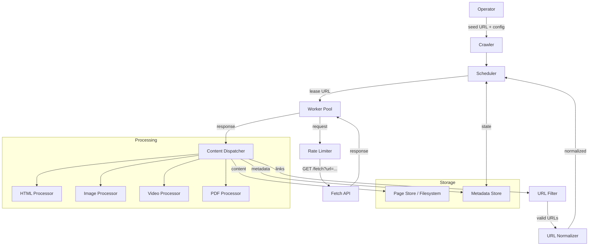
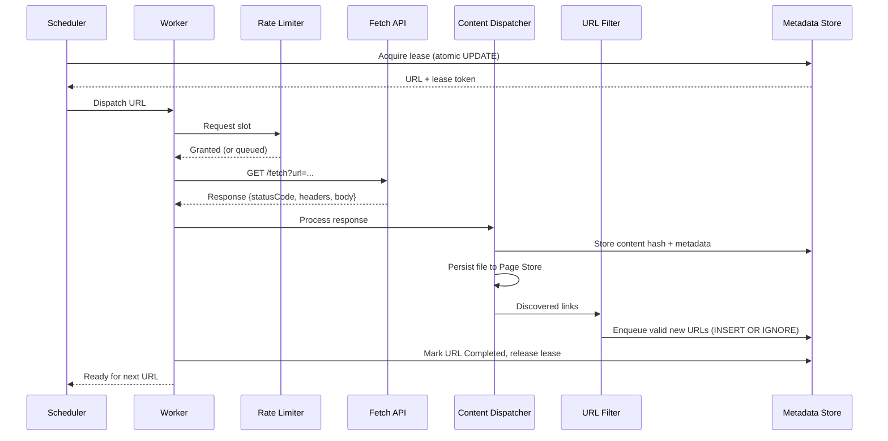
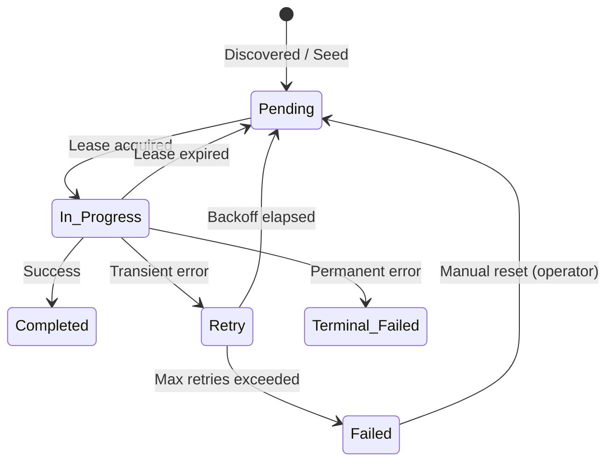
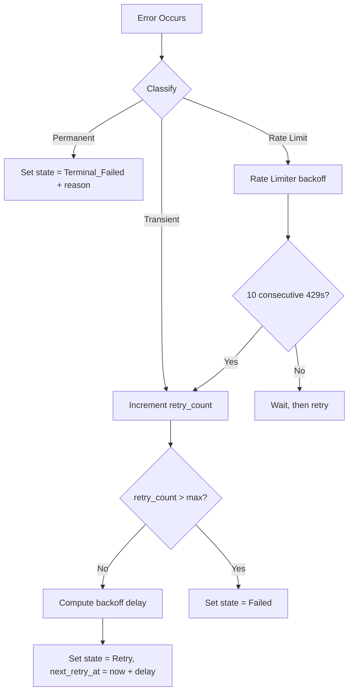

# Design Document: Web Crawler

## Overview

This document describes the technical design for a production-grade web crawler that starts from a seed URL and recursively discovers and downloads an entire website's content. The crawler uses a mock HTTP Fetch API and persists all state to an embedded SQLite database, supporting concurrency, fault tolerance, resumability, and rate-limit compliance.

### Design Goals

- **Single-process, zero-infrastructure**: SQLite for state, filesystem for content — no Redis, RabbitMQ, or external services.
- **Correct under concurrency**: Atomic lease mechanism ensures mutual exclusion without distributed locks.
- **Resilient**: Exponential backoff, lease expiration, and persistent state guarantee no URL is lost or stuck.
- **Extensible**: Content processors are registered in a table keyed by MIME type prefix; adding a new type requires no modification to existing code.

### Technology Stack

| Concern | Choice | Rationale |
|---------|--------|-----------|
| Language | Python 3.12+ with asyncio | Clean async/await syntax; rich ecosystem for HTML/PDF/image processing |
| Database | SQLite via `aiosqlite` | Embedded, ACID, supports WAL mode for concurrent reads, no infra overhead |
| HTML Parsing | `beautifulsoup4` with `lxml` parser | Fast, robust HTML parsing with CSS selector support |
| PDF Parsing | `pypdf` | Lightweight PDF metadata and page count extraction |
| Image Dimensions | `Pillow` (PIL) | Industry-standard image processing; dimension extraction from bytes |
| Hashing | Python built-in `hashlib` | SHA-256 via `hashlib.sha256()` — zero dependencies |
| URL Parsing | Python built-in `urllib.parse` | Standard library URL normalization and resolution |
| Data Models | `pydantic` | Validated, serializable data structures with runtime type checking |
| Configuration | `PyYAML` | Human-readable config files; config frozen to DB for resumability |
| HTTP Client | `httpx` | Async HTTP client for Fetch API communication |
| Testing | `pytest` + `hypothesis` | Property-based testing with powerful strategy combinators |

### Why SQLite Over a Message Broker (e.g., RabbitMQ)

The crawl frontier is **not a traditional message queue**. Each URL record carries rich metadata (depth, parent, retry count, lease token, content hash, failure reason) that requires **atomic state transitions** — not simple produce/consume semantics. SQLite provides this naturally via SQL transactions.

**Dead-letter behavior is already implemented** via the `Failed` and `Terminal_Failed` states. Unlike a broker's opaque dead-letter queue, these records are queryable, inspectable, and manually resettable by an operator — no broker administration tooling required.

**The lease mechanism provides exactly-once delivery semantics** without the complexity of broker ACK/NACK protocols. A single atomic `UPDATE ... WHERE lease_token = :token` rejects stale writes, and expired leases automatically return URLs to the work pool.

**SQLite in WAL mode handles single-process async concurrency without contention.** Since all workers run as asyncio tasks within one process, there is no cross-process coordination overhead. WAL mode allows concurrent readers while a single writer proceeds without blocking.

**Zero infrastructure overhead.** No broker to install, configure, monitor, or restart. The entire crawl state is a single file that can be inspected with standard SQLite tooling.

**When RabbitMQ WOULD be appropriate:**
- Distributed workers across multiple machines or processes
- Multi-process scaling where workers need independent failure domains
- Pub/sub routing where different consumers handle different URL types
- When crawl throughput exceeds what a single process can sustain

For this single-process, single-machine crawler, SQLite provides equivalent semantics with dramatically less complexity.

---

## Architecture

### High-Level Architecture Diagram



### Component Interaction Sequence



### URL State Machine



---

## Components and Interfaces

### 1. Crawler (Entry Point)

The top-level orchestrator. Validates configuration, bootstraps storage, seeds the queue, and runs the scheduler loop until the crawl frontier is exhausted. Configuration is read from a YAML file at start and frozen into the database for resumability.

```python
from pydantic import BaseModel, Field
from typing import Optional
from pathlib import Path


class CrawlerConfig(BaseModel):
    seed_url: str
    max_depth: Optional[int] = None        # default: unlimited, range: 1–1000
    max_concurrency: int = 5               # range: 1–100
    max_retries: int = 3                   # range: 0–10
    max_content_size: int = 50 * 1024 * 1024  # default: 50MB, range: 1KB–1GB
    max_redirects: int = 5                     # default: 5, max redirect chain length
    include_patterns: list[str] = Field(default_factory=list)
    exclude_patterns: list[str] = Field(default_factory=list)
    lease_timeout_ms: int = 60_000         # default: 60s
    batch_size: int = 50                   # range: 1–500
    progress_interval_ms: int = 10_000     # default: 10s

    @classmethod
    def from_yaml(cls, path: Path) -> "CrawlerConfig":
        """Load configuration from a YAML file."""
        import yaml
        with open(path) as f:
            data = yaml.safe_load(f)
        return cls(**data)


class CrawlResult(BaseModel):
    total_discovered: int
    total_completed: int
    total_failed: int
    total_terminal_failed: int
    duration_ms: int


class Crawler:
    async def start(self, config_path: Path) -> CrawlResult:
        """Load config from YAML, validate, freeze to DB, and begin crawling."""
        ...
    async def resume(self) -> CrawlResult:
        """Resume using frozen config from DB (ignores YAML)."""
        ...
    async def stop(self) -> None: ...
```

### 2. Scheduler

Coordinates the crawl loop: queries the frontier for work, acquires leases, dispatches workers, and handles completions/failures.

```python
class LeaseResult(BaseModel):
    normalized_url: str
    url: str
    depth: int
    lease_token: str
    lease_expires_at: int  # Unix timestamp ms


class Scheduler:
    async def init(self, config: CrawlerConfig, store: "MetadataStore") -> None: ...
    async def run(self) -> None: ...
    async def shutdown(self) -> None: ...
```

**Algorithm — Scheduler Main Loop:**

```python
async def run(self) -> None:
    while not self._shutdown_requested:
        # Only lease as many URLs as the worker pool can currently absorb
        available_slots = self.config.max_concurrency - self.worker_pool.active_count()
        if available_slots <= 0:
            await self.worker_pool.wait_for_slot()
            continue

        lease_count = min(available_slots, self.config.batch_size)
        batch = await self.metadata_store.acquire_lease_batch(
            lease_count, self.config.lease_timeout_ms
        )
        if not batch:
            # Check terminal condition: no processable URLs remain
            counts = await self.metadata_store.get_state_counts()
            if counts["Pending"] == 0 and counts["Retry"] == 0 and counts["In_Progress"] == 0:
                break  # crawl complete
            # Otherwise, workers are still active or retries pending — wait and retry
            await asyncio.sleep(self._poll_interval_s)
            continue

        for url_record in batch:
            await self.worker_pool.dispatch(url_record)

        await asyncio.sleep(self._poll_interval_s)
```

### 3. Worker Pool

Manages a bounded pool of concurrent workers. Each worker processes a single URL to completion.

```python
class WorkerPool:
    async def dispatch(self, lease: LeaseResult) -> None: ...
    def has_capacity(self) -> bool: ...
    async def wait_for_slot(self) -> None: ...
    def active_count(self) -> int: ...
    async def drain(self) -> None: ...
```

### 4. Worker

A single unit of work: fetch → process → persist → report.

```python
class WorkerResult(BaseModel):
    normalized_url: str
    status: str  # 'completed' | 'retry' | 'terminal_failed'
    content_hash: Optional[str] = None
    content_type: Optional[str] = None
    metadata: Optional[dict] = None
    discovered_urls: list[str] = Field(default_factory=list)
    failure_reason: Optional[str] = None
```

**Algorithm — Worker Execution:**

```python
async def process_url(self, lease: LeaseResult) -> WorkerResult:
    try:
        response = await self.rate_limiter.execute(
            lambda: self.fetch_url(lease.url)
        )

        match response.status_code:
            case 200:
                if response.body is None:
                    return self._terminal_failed(lease, "empty body")
                if len(response.body) > self.config.max_content_size:
                    return self._terminal_failed(lease, "content too large")
                content_hash = hashlib.sha256(response.body).hexdigest()
                result = await self.content_dispatcher.process(response, lease)
                await self._enqueue_discovered_urls(result.discovered_urls, lease.depth + 1)
                await self.metadata_store.mark_completed(
                    lease, content_hash, result.metadata
                )
                return self._completed(lease, content_hash, result)

            case 301 | 302:
                redirect_url = response.headers.get("location")
                if not redirect_url:
                    return self._terminal_failed(lease, "missing redirect location")
                # Track redirect chain to prevent infinite loops
                redirect_count = await self.metadata_store.get_redirect_count(lease.normalized_url)
                if redirect_count >= self.config.max_redirects:
                    return self._terminal_failed(lease, "redirect loop detected")
                normalized = self.url_normalizer.normalize(redirect_url)
                if normalized and self.url_filter.passes(normalized, lease.depth):
                    await self.metadata_store.enqueue(
                        normalized, redirect_url, lease.depth, lease.url,
                        redirect_count=redirect_count + 1
                    )
                await self.metadata_store.mark_completed(lease)
                return self._completed(lease)

            case 404:
                return self._terminal_failed(lease, "not found")
            case 403:
                return self._terminal_failed(lease, "blocked")
            case 429:
                pass  # handled by rate_limiter; retry
            case 500:
                return self._transient_error(lease, "server error")
            case _:
                return self._terminal_failed(
                    lease, f"unexpected status code: {response.status_code}"
                )

    except NetworkError as e:
        return self._transient_error(lease, str(e))
    except Exception as e:
        # Catch-all for unexpected processor errors (malformed content, etc.)
        return self._terminal_failed(lease, f"processing error: {e}")
```

**Lease Heartbeat** — Each worker runs a background heartbeat task that periodically extends its lease while processing is in progress. This prevents lease expiry during long operations (large downloads, CPU-intensive parsing) without requiring the worker to predict processing time upfront:

```python
    # The worker spawns a heartbeat coroutine alongside processing:
    async def _lease_heartbeat(self, lease: LeaseResult) -> None:
        """Periodically renew the lease until cancelled or max renewals reached."""
        renewal_interval = self.config.lease_timeout_ms / 2 / 1000  # renew at 50% of TTL
        renewals = 0
        max_renewals = 3
        while renewals < max_renewals:
            await asyncio.sleep(renewal_interval)
            success = await self.metadata_store.renew_lease(
                lease.normalized_url, lease.lease_token, self.config.lease_timeout_ms
            )
            if not success:
                break  # lease was stolen or URL state changed
            renewals += 1

    async def process_url(self, lease: LeaseResult) -> WorkerResult:
        heartbeat_task = asyncio.create_task(self._lease_heartbeat(lease))
        try:
            return await self._do_process(lease)
        finally:
            heartbeat_task.cancel()
            with contextlib.suppress(asyncio.CancelledError):
                await heartbeat_task
```

### 5. Rate Limiter

Centralized token-bucket rate limiter with 429 backoff handling.

```python
from typing import Awaitable, Callable, TypeVar

T = TypeVar("T")


class RateLimiter:
    async def execute(self, fn: Callable[[], Awaitable[T]]) -> T: ...
    def queue_size(self) -> int: ...
    def is_backing_off(self) -> bool: ...
```

**Algorithm — Rate Limiter:**

The rate limiter uses a pending-count with an `asyncio.Lock` for capacity enforcement,
an `asyncio.Semaphore` for concurrency gating, and an `asyncio.Event` for global backoff
pause. Each `execute()` call tracks its own consecutive-429 counter (per Requirement 6.7:
"IF a single request receives 10 consecutive 429 responses").

```python
class RateLimiter:
    def __init__(self, max_concurrency: int = 10) -> None:
        self._semaphore = asyncio.Semaphore(max_concurrency)
        self._backoff_event = asyncio.Event()
        self._backoff_event.set()  # Not backing off initially
        self._pending_count = 0
        self._pending_lock = asyncio.Lock()

    async def execute(self, fn: Callable[[], Awaitable[T]]) -> T:
        # Capacity check — reject if 1000 requests already pending
        async with self._pending_lock:
            if self._pending_count >= 1000:
                raise QueueOverflowError("Rate limiter queue at capacity (1000)")
            self._pending_count += 1
        try:
            return await self._execute_with_retry(fn)
        finally:
            async with self._pending_lock:
                self._pending_count -= 1

    async def _execute_with_retry(self, fn: Callable[[], Awaitable[T]]) -> T:
        consecutive_429_count = 0
        while True:
            await self._backoff_event.wait()       # global pause gate
            await self._semaphore.acquire()        # concurrency slot
            try:
                result = await fn()
            except Exception:
                self._semaphore.release()
                raise
            else:
                self._semaphore.release()

            if result.status_code == 429:
                consecutive_429_count += 1
                if consecutive_429_count >= 10:
                    raise RateLimitExhaustedError()
                backoff_duration = self._compute_backoff(
                    result.headers.get("retry-after"), consecutive_429_count
                )
                await self._apply_backoff(backoff_duration)
                continue
            return result

    def _compute_backoff(self, retry_after: Optional[str], consecutive_count: int) -> float:
        if retry_after is not None:
            value = float(retry_after)
            if value > 300:
                return 300.0
            if value >= 1:
                return value
        # No header: exponential backoff
        return min(1.0 * 2 ** (consecutive_count - 1), 60.0)

    async def _apply_backoff(self, duration: float) -> None:
        self._backoff_event.clear()
        try:
            await asyncio.sleep(duration)
        finally:
            self._backoff_event.set()
```

### 6. URL Normalizer

Implements deterministic URL canonicalization per Requirement 3 using a composable pipeline of step classes. Each normalization transformation is an independent `NormalizationStep` class, configured via YAML.

**Architecture**: Chain-of-responsibility pattern. The `URLNormalizer` facade delegates to a `NormalizationPipeline` that executes an ordered list of `NormalizationStep` instances. Steps communicate through a mutable `NormalizationContext` dataclass.

```python
# Public API (unchanged)
class URLNormalizer:
    def __init__(self, config_path: Optional[Path] = None) -> None: ...
    def normalize(self, raw_url: str) -> Optional[str]:
        """Returns canonical URL string, or None if unparseable."""
        return self._pipeline.execute(raw_url)
```

**Pipeline Infrastructure** (`src/crawler/pipeline/`):

```python
@dataclass
class NormalizationContext:
    raw_url: str
    parsed: Optional[ParseResult] = None
    scheme: str = ""
    host: str = ""
    port: Optional[int] = None
    path: str = ""
    query: str = ""
    rejected: bool = False


class NormalizationStep(ABC):
    @abstractmethod
    def execute(self, ctx: NormalizationContext) -> NormalizationContext: ...
    @property
    @abstractmethod
    def name(self) -> str: ...


class NormalizationPipeline:
    def __init__(self, steps: list[NormalizationStep]) -> None: ...
    def execute(self, raw_url: str) -> Optional[str]:
        """Run steps in order. Return None if any step rejects. Reconstruct URL on success."""
        ...
```

**Concrete Normalization Steps** (executed in registry order):

| Step Class | `name` | Responsibility |
|---|---|---|
| `ParseURLStep` | `parse_url` | Parse URL, reject if empty/no scheme/no hostname |
| `LowercaseStep` | `lowercase` | Lowercase scheme and host |
| `RemoveDefaultPortStep` | `remove_default_port` | Remove port 80 for http, 443 for https |
| `RemoveFragmentStep` | `remove_fragment` | No-op (fragment not carried in context) |
| `SortQueryParamsStep` | `sort_query_params` | Sort query params by name, then value |
| `UppercasePercentEncodingStep` | `uppercase_percent_encoding` | Uppercase hex in percent-encoded triplets |
| `DecodeUnreservedStep` | `decode_unreserved` | Decode unreserved chars per RFC 3986 §2.3 |
| `TrailingSlashStep` | `trailing_slash` | Remove trailing slash for non-root, ensure "/" for bare domains |

**YAML Configuration** (`pipeline_config.yaml`):

```yaml
normalizer:
  steps:
    parse_url:
      enabled: true
    lowercase:
      enabled: true
    # ... each step can be enabled/disabled independently
```

**Adding a new step**: Create a class extending `NormalizationStep`, add it to `NORMALIZATION_STEPS` registry, enable in YAML.

**Invariant**: `normalize(normalize(u)) == normalize(u)` for all valid URLs `u`.

### 7. URL Filter

Validates discovered URLs against crawl policy using a composable pipeline of step classes. Each filter check is an independent `FilterStep` class, configured via YAML. The pipeline short-circuits on the first rejection.

**Architecture**: Same chain-of-responsibility pattern as the normalizer. The `URLFilter` facade delegates to a `FilterPipeline` that executes an ordered list of `FilterStep` instances. Steps read from an immutable `FilterContext` and return a boolean pass/reject decision.

```python
# Public API (unchanged)
class URLFilter:
    def __init__(self, seed_domain, max_depth, include_patterns, exclude_patterns, store,
                 config_path: Optional[Path] = None) -> None: ...
    def passes(self, url: str, depth: int) -> bool:
        """Returns True if URL passes all filter checks (short-circuits on first rejection)."""
        ...
```

**Pipeline Infrastructure**:

```python
@dataclass
class FilterContext:
    url: str
    parsed: ParseResult
    depth: int
    seed_domain: str
    max_depth: Optional[int]
    include_patterns: list[str]
    exclude_patterns: list[str]
    store: object  # MetadataStore


class FilterStep(ABC):
    @abstractmethod
    def execute(self, ctx: FilterContext) -> bool: ...
    @property
    @abstractmethod
    def name(self) -> str: ...


class FilterPipeline:
    def execute(self, ctx: FilterContext) -> bool:
        """Run steps in order. Return False on first rejection (short-circuit)."""
        ...
```

**Concrete Filter Steps** (executed in registry order):

| Step Class | `name` | Responsibility |
|---|---|---|
| `SchemeCheckStep` | `scheme_check` | Reject if scheme not http/https |
| `DomainMatchStep` | `domain_match` | Reject if hostname != seed_domain |
| `DepthCheckStep` | `depth_check` | Reject if depth > max_depth (when configured) |
| `ExcludePatternStep` | `exclude_pattern` | Reject if URL matches any exclude pattern |
| `IncludePatternStep` | `include_pattern` | Reject if no include pattern matches (when configured) |
| `DeduplicationStep` | `deduplication` | Reject if URL exists in MetadataStore |

**YAML Configuration**:

```yaml
filter:
  steps:
    scheme_check:
      enabled: true
    domain_match:
      enabled: true
    # ... each step can be enabled/disabled independently
```

**Adding a new filter step**: Create a class extending `FilterStep`, add it to `FILTER_STEPS` registry, enable in YAML.

### 8. Content Dispatcher

Routes responses to type-specific handlers based on Content-Type header. Each handler is a class implementing the `BaseProcessor` abstract base class.

```python
from abc import ABC, abstractmethod
from typing import Optional
import hashlib


class BaseProcessor(ABC):
    """Abstract base class for all content type processors."""

    @abstractmethod
    async def process(
        self, response: "FetchResponse", lease: LeaseResult, store: "MetadataStore"
    ) -> "ProcessorResult":
        """Process a fetched response and return extracted metadata + discovered URLs."""
        ...

    def compute_hash(self, body: bytes) -> str:
        """Compute SHA-256 content hash of raw body bytes."""
        return hashlib.sha256(body).hexdigest()

    async def write_file_if_not_exists(self, file_path: str, body: bytes) -> None:
        """Persist content to disk only if the file doesn't already exist."""
        import aiofiles
        import os
        if not os.path.exists(file_path):
            async with aiofiles.open(file_path, "wb") as f:
                await f.write(body)


class ProcessorResult(BaseModel):
    discovered_urls: list[str] = Field(default_factory=list)
    metadata: dict
    content_hash: str
    file_path: str


class ContentDispatcher:
    """Dispatcher that routes responses to registered type-specific processors."""

    def __init__(self) -> None:
        self._processors: dict[str, BaseProcessor] = {}

    def register(self, mime_prefix: str, processor: BaseProcessor) -> None:
        """Register a processor for a given MIME type or prefix."""
        self._processors[mime_prefix] = processor

    def dispatch(self, content_type: str) -> Optional[BaseProcessor]:
        """Find the matching processor. Exact match first, then prefix match."""
        for key, handler in self._processors.items():
            if content_type.startswith(key):
                return handler
        return None  # unsupported → Terminal_Failed

    async def process(
        self, response: "FetchResponse", lease: LeaseResult, store: "MetadataStore"
    ) -> Optional[ProcessorResult]:
        """Dispatch and process a response. Returns None if unsupported type."""
        content_type = response.headers.get("content-type", "")
        processor = self.dispatch(content_type)
        if processor is None:
            return None
        return await processor.process(response, lease, store)


# --- Registration (in Crawler bootstrap) ---
# content_dispatcher = ContentDispatcher()
# content_dispatcher.register("text/html", HtmlProcessor())
# content_dispatcher.register("image/", ImageProcessor())
# content_dispatcher.register("video/", VideoProcessor())
# content_dispatcher.register("application/pdf", PdfProcessor())
```

### 9. HTML Processor

```python
from bs4 import BeautifulSoup
from urllib.parse import urljoin
import hashlib


class HtmlMetadata(BaseModel):
    page_title: str
    link_count: int


class HtmlProcessor(BaseProcessor):
    """Processes text/html responses: extracts links, title, and persists raw HTML."""

    async def process(
        self, response: "FetchResponse", lease: LeaseResult, store: "MetadataStore"
    ) -> ProcessorResult:
        body = response.body
        content_hash = await asyncio.to_thread(self.compute_hash, body)

        # Skip re-persist if hash unchanged
        stored_hash = await store.get_content_hash(lease.normalized_url)
        if stored_hash == content_hash:
            await store.update_timestamp(lease.normalized_url)
            return ProcessorResult(
                discovered_urls=[],
                metadata={"page_title": "", "link_count": 0},
                content_hash=content_hash,
                file_path="",
            )

        # CPU-bound parsing offloaded to thread pool
        title, resolved_links = await asyncio.to_thread(
            self._parse_html, body, lease.url
        )

        # Persist to output/html/<hash>.html
        file_path = f"output/html/{content_hash}.html"
        await self.write_file_if_not_exists(file_path, body)

        return ProcessorResult(
            discovered_urls=resolved_links,
            metadata={"page_title": title, "link_count": len(resolved_links)},
            content_hash=content_hash,
            file_path=file_path,
        )

    def _parse_html(self, body: bytes, base_url: str) -> tuple[str, list[str]]:
        """Synchronous HTML parsing, run in a thread."""
        try:
            soup = BeautifulSoup(body, "lxml")
        except Exception:
            return ("", [])

        title_tag = soup.find("title")
        title = title_tag.get_text() if title_tag else ""

        # Extract links from <a href>, , <video src>, <script src>
        raw_links: list[str] = []
        for a in soup.find_all("a", href=True):
            raw_links.append(a["href"])
        for tag in soup.find_all(["img", "video", "script"], src=True):
            raw_links.append(tag["src"])

        # Resolve relative URLs against page base URL
        resolved_links: list[str] = []
        for link in raw_links:
            resolved = self._safe_resolve(base_url, link)
            if resolved is not None:
                resolved_links.append(resolved)

        return (title, resolved_links)

    def _safe_resolve(self, base_url: str, link: str) -> Optional[str]:
        """Resolve a relative URL against the base. Returns None if unresolvable."""
        try:
            resolved = urljoin(base_url, link)
            if resolved.startswith(("http://", "https://")):
                return resolved
        except Exception:
            pass
        return None
```

### 10. Image Processor

```python
from PIL import Image
import io


class ImageMetadata(BaseModel):
    width: Optional[int] = None
    height: Optional[int] = None
    file_size_bytes: int


class ImageProcessor(BaseProcessor):
    """Processes image/* responses: extracts dimensions, file size, and persists raw image."""

    async def process(
        self, response: "FetchResponse", lease: LeaseResult, store: "MetadataStore"
    ) -> ProcessorResult:
        body = response.body
        content_hash = await asyncio.to_thread(self.compute_hash, body)
        content_length = response.headers.get("content-length")
        file_size_bytes = int(content_length) if content_length else len(body)

        # CPU-bound image decode offloaded to thread pool
        width, height = await asyncio.to_thread(self._extract_dimensions, body, lease.url)

        ext = mime_to_extension(response.headers.get("content-type", "")) or "bin"
        file_path = f"output/images/{content_hash}.{ext}"
        await self.write_file_if_not_exists(file_path, body)

        return ProcessorResult(
            discovered_urls=[],
            metadata={"width": width, "height": height, "file_size_bytes": file_size_bytes},
            content_hash=content_hash,
            file_path=file_path,
        )

    def _extract_dimensions(self, body: bytes, url: str) -> tuple[Optional[int], Optional[int]]:
        """Synchronous image dimension extraction, run in a thread."""
        try:
            img = Image.open(io.BytesIO(body))
            return img.size
        except Exception as e:
            logger.warning(f"Image decode failed for {url}: {e}")
            return (None, None)
```

### 11. Video Processor

```python
class VideoMetadata(BaseModel):
    file_size_bytes: int
    duration_seconds: Optional[float] = None


class VideoProcessor(BaseProcessor):
    """Processes video/* responses: extracts file size, duration, and persists raw video."""

    async def process(
        self, response: "FetchResponse", lease: LeaseResult, store: "MetadataStore"
    ) -> ProcessorResult:
        body = response.body
        content_hash = await asyncio.to_thread(self.compute_hash, body)

        content_length = response.headers.get("content-length")
        file_size_bytes = int(content_length) if content_length else len(body)

        # Check for truncation
        if content_length and len(body) < int(content_length):
            raise TransientError("truncated download")

        # Duration from custom header if available
        x_duration = response.headers.get("x-duration")
        duration_seconds = float(x_duration) if x_duration else None

        ext = mime_to_extension(response.headers.get("content-type", "")) or "bin"
        file_path = f"output/videos/{content_hash}.{ext}"
        await self.write_file_if_not_exists(file_path, body)

        return ProcessorResult(
            discovered_urls=[],
            metadata={"file_size_bytes": file_size_bytes, "duration_seconds": duration_seconds},
            content_hash=content_hash,
            file_path=file_path,
        )
```

### 12. PDF Processor

```python
from pypdf import PdfReader
import io


class PdfMetadata(BaseModel):
    page_count: Optional[int] = None
    document_title: Optional[str] = None


class PdfProcessor(BaseProcessor):
    """Processes application/pdf responses: extracts page count, title, and persists raw PDF."""

    async def process(
        self, response: "FetchResponse", lease: LeaseResult, store: "MetadataStore"
    ) -> ProcessorResult:
        body = response.body
        content_hash = await asyncio.to_thread(self.compute_hash, body)

        # CPU-bound PDF parsing offloaded to thread pool
        page_count, document_title = await asyncio.to_thread(
            self._parse_pdf, body, lease.url
        )

        file_path = f"output/pdfs/{content_hash}.pdf"
        await self.write_file_if_not_exists(file_path, body)

        return ProcessorResult(
            discovered_urls=[],
            metadata={"page_count": page_count, "document_title": document_title},
            content_hash=content_hash,
            file_path=file_path,
        )

    def _parse_pdf(self, body: bytes, url: str) -> tuple[Optional[int], Optional[str]]:
        """Synchronous PDF parsing, run in a thread."""
        try:
            reader = PdfReader(io.BytesIO(body))
            page_count = len(reader.pages)
            document_title = reader.metadata.title if reader.metadata else ""
            return (page_count, document_title)
        except Exception as e:
            logger.warning(f"PDF parse failed for {url}: {e}")
            return (None, None)
```

### 13. Metadata Store

The Metadata Store wraps SQLite and provides all state management operations.

```python
class MetadataStore:
    # Initialization
    async def init(self) -> None: ...
    async def store_config(self, config: CrawlerConfig) -> None: ...
    async def load_config(self) -> Optional[CrawlerConfig]: ...

    # Crawl frontier operations
    async def enqueue(
        self, url: str, normalized_url: str, depth: int, parent_url: Optional[str]
    ) -> None: ...
    async def acquire_lease_batch(
        self, batch_size: int, lease_ttl_ms: int, worker_id: str
    ) -> list[LeaseResult]: ...
    async def renew_lease(
        self, normalized_url: str, lease_token: str, extension_ms: int
    ) -> bool: ...

    # State transitions (all return bool: True on success, False on stale write)
    async def mark_completed(
        self, normalized_url: str, lease_token: str,
        content_hash: Optional[str] = None, content_type: Optional[str] = None,
        etag: Optional[str] = None, metadata: Optional[dict] = None
    ) -> bool: ...
    async def mark_retry(
        self, normalized_url: str, lease_token: str,
        retry_count: int, next_retry_at: Optional[int] = None,
        next_retry_at_ms: Optional[int] = None, reason: Optional[str] = None
    ) -> bool: ...
    async def mark_terminal_failed(
        self, normalized_url: str, lease_token: str, reason: Optional[str] = None
    ) -> bool: ...
    async def mark_failed(
        self, normalized_url: str, lease_token: Optional[str] = None,
        reason: Optional[str] = None
    ) -> bool: ...
    async def expire_leases(self) -> int: ...

    # Queries
    async def get_content_hash(self, normalized_url: str) -> Optional[str]: ...
    async def get_urls_by_state(self, state: str, limit: int = 500) -> list[dict]: ...
    async def get_state_counts(self) -> dict[str, int]: ...
    async def get_child_urls(self, parent_url: str) -> list[dict]: ...
    async def get_redirect_count(self, normalized_url: str) -> int: ...
    async def exists(self, normalized_url: str) -> bool: ...

    # Content-type metadata
    async def store_html_metadata(self, normalized_url: str, meta: HtmlMetadata) -> None: ...
    async def store_image_metadata(self, normalized_url: str, meta: ImageMetadata) -> None: ...
    async def store_video_metadata(self, normalized_url: str, meta: VideoMetadata) -> None: ...
    async def store_pdf_metadata(self, normalized_url: str, meta: PdfMetadata) -> None: ...
```

### 14. Logger

Structured logging with configurable output.

```python
import logging


class CrawlLogger:
    def info(self, message: str, **context: object) -> None: ...
    def warn(self, message: str, **context: object) -> None: ...
    def error(self, message: str, **context: object) -> None: ...
    def state_transition(
        self, url: str, from_state: str, to_state: str, worker_id: str
    ) -> None: ...
    def progress(self, stats: dict) -> None: ...
```

---

## Data Models

### SQLite Schema

```sql
-- Crawl configuration (one row per crawl)
CREATE TABLE crawl_config (
  id INTEGER PRIMARY KEY DEFAULT 1,
  seed_url TEXT NOT NULL,
  seed_domain TEXT NOT NULL,
  max_depth INTEGER,
  max_concurrency INTEGER NOT NULL DEFAULT 5,
  max_retries INTEGER NOT NULL DEFAULT 3,
  max_content_size INTEGER NOT NULL DEFAULT 52428800,
  lease_timeout_ms INTEGER NOT NULL DEFAULT 60000,
  batch_size INTEGER NOT NULL DEFAULT 50,
  include_patterns TEXT,  -- JSON array
  exclude_patterns TEXT,  -- JSON array
  created_at TEXT NOT NULL DEFAULT (datetime('now'))
);

-- Main URL records (crawl frontier + state)
CREATE TABLE url_records (
  normalized_url TEXT PRIMARY KEY,
  url TEXT NOT NULL,
  crawl_state TEXT NOT NULL DEFAULT 'Pending'
    CHECK (crawl_state IN ('Pending','In_Progress','Completed','Retry','Failed','Terminal_Failed')),
  lease_owner_id TEXT,
  lease_token TEXT,
  lease_expires_at INTEGER,  -- Unix timestamp ms
  retry_count INTEGER NOT NULL DEFAULT 0,
  redirect_count INTEGER NOT NULL DEFAULT 0,
  next_retry_at INTEGER,     -- Unix timestamp ms
  crawl_depth INTEGER NOT NULL DEFAULT 0,
  parent_url TEXT,
  content_type TEXT,
  content_hash TEXT,
  etag TEXT,
  last_crawl_timestamp TEXT,
  failure_reason TEXT,
  discovered_at TEXT NOT NULL DEFAULT (datetime('now')),
  FOREIGN KEY (parent_url) REFERENCES url_records(normalized_url)
);

-- Indexes for efficient frontier queries
CREATE INDEX idx_url_records_state ON url_records(crawl_state);
CREATE INDEX idx_url_records_retry ON url_records(crawl_state, next_retry_at)
  WHERE crawl_state = 'Retry';
CREATE INDEX idx_url_records_lease ON url_records(crawl_state, lease_expires_at)
  WHERE crawl_state = 'In_Progress';
CREATE INDEX idx_url_records_parent ON url_records(parent_url);

-- HTML-specific metadata
CREATE TABLE html_metadata (
  normalized_url TEXT PRIMARY KEY,
  page_title TEXT NOT NULL DEFAULT '',
  link_count INTEGER NOT NULL DEFAULT 0,
  FOREIGN KEY (normalized_url) REFERENCES url_records(normalized_url)
);

-- Image-specific metadata
CREATE TABLE image_metadata (
  normalized_url TEXT PRIMARY KEY,
  width INTEGER,
  height INTEGER,
  file_size_bytes INTEGER NOT NULL,
  FOREIGN KEY (normalized_url) REFERENCES url_records(normalized_url)
);

-- Video-specific metadata
CREATE TABLE video_metadata (
  normalized_url TEXT PRIMARY KEY,
  file_size_bytes INTEGER NOT NULL,
  duration_seconds REAL,
  FOREIGN KEY (normalized_url) REFERENCES url_records(normalized_url)
);

-- PDF-specific metadata
CREATE TABLE pdf_metadata (
  normalized_url TEXT PRIMARY KEY,
  page_count INTEGER,
  document_title TEXT,
  FOREIGN KEY (normalized_url) REFERENCES url_records(normalized_url)
);
```

### SQLite Configuration

```python
import aiosqlite


async def init_db(db_path: str = "crawl.db") -> aiosqlite.Connection:
    db = await aiosqlite.connect(db_path)
    await db.execute("PRAGMA journal_mode = WAL")         # Concurrent reads during writes
    await db.execute("PRAGMA busy_timeout = 5000")        # Wait up to 5s on lock contention
    await db.execute("PRAGMA synchronous = NORMAL")       # Balance durability and performance
    await db.execute("PRAGMA foreign_keys = ON")
    return db
```

### Key Atomic Operations

**Lease Acquisition (single atomic statement):**

```sql
UPDATE url_records
SET crawl_state = 'In_Progress',
    lease_owner_id = :workerId,
    lease_token = :leaseToken,
    lease_expires_at = :expiresAt
WHERE normalized_url IN (
  SELECT normalized_url FROM url_records
  WHERE (crawl_state = 'Pending')
     OR (crawl_state = 'Retry' AND next_retry_at <= :now)
     OR (crawl_state = 'In_Progress' AND lease_expires_at < :now)
  ORDER BY
    CASE crawl_state
      WHEN 'Retry' THEN 0        -- Priority: retries first
      WHEN 'In_Progress' THEN 1  -- Then expired leases
      WHEN 'Pending' THEN 2      -- Then new URLs
    END,
    crawl_depth ASC              -- BFS: shallow first
  LIMIT :batchSize
)
RETURNING *;
```

**Stale Write Rejection (on completion):**

```sql
UPDATE url_records
SET crawl_state = 'Completed',
    content_hash = :hash,
    content_type = :contentType,
    last_crawl_timestamp = datetime('now'),
    lease_owner_id = NULL,
    lease_token = NULL,
    lease_expires_at = NULL
WHERE normalized_url = :url
  AND lease_token = :leaseToken
  AND crawl_state = 'In_Progress';
-- If rows affected = 0, the lease was expired/stolen → reject
```

**Atomic Enqueue (deduplication):**

```sql
INSERT OR IGNORE INTO url_records (normalized_url, url, crawl_state, crawl_depth, parent_url)
VALUES (:normalizedUrl, :rawUrl, 'Pending', :depth, :parentUrl);
```

### Output Directory Structure

```
output/
├── html/
│   ├── a1b2c3d4...f0.html
│   └── ...
├── images/
│   ├── e5f6a7b8...c2.jpg
│   ├── d3e4f5a6...b1.png
│   └── ...
├── videos/
│   ├── f7a8b9c0...d4.mp4
│   └── ...
└── pdfs/
    ├── c1d2e3f4...a5.pdf
    └── ...
```

Files are named by content hash + type-derived extension, implementing content-addressed storage naturally.

---

## Correctness Properties

*A property is a characteristic or behavior that should hold true across all valid executions of a system — essentially, a formal statement about what the system should do. Properties serve as the bridge between human-readable specifications and machine-verifiable correctness guarantees.*

### Property 1: URL Normalization Idempotence

*For any* valid URL string `u`, applying the normalization function twice produces the same result as applying it once: `normalize(normalize(u)) == normalize(u)`.

**Validates: Requirements 3.1, 3.5**

### Property 2: URL Deduplication

*For any* pair of raw URLs `(u1, u2)` where `normalize(u1) == normalize(u2)`, enqueueing both into the Metadata_Store results in exactly one URL record.

**Validates: Requirements 2.2, 3.2, 3.3, 7.5**

### Property 3: URL Filter Domain/Scheme/Depth Enforcement

*For any* discovered URL, the URL_Filter SHALL reject it if: (a) its registered domain does not match the Seed_Domain, OR (b) its scheme is not `http` or `https`, OR (c) its computed Crawl_Depth exceeds the configured maximum.

**Validates: Requirements 7.1, 7.2, 7.3**

### Property 4: Exclude Pattern Precedence

*For any* URL that matches both an exclude pattern and an include pattern, the URL_Filter SHALL reject it — exclude patterns always take precedence over include patterns.

**Validates: Requirements 7.4**

### Property 5: Lease Mutual Exclusion

*For any* URL `u` and any set of concurrent Workers, at most one Worker holds an active (non-expired) Lease on `u` at any given time.

**Validates: Requirements 4.1, 4.3, 4.6**

### Property 6: Expired Lease Recovery and Stale Write Rejection

*For any* URL with a Lease whose `lease_expires_at` timestamp is in the past, the URL becomes acquirable by another Worker; any subsequent write attempt using the original (expired) lease token SHALL be rejected.

**Validates: Requirements 4.4**

### Property 7: Lease Renewal Bound

*For any* URL in a single lease cycle, a Worker can successfully renew the Lease at most 3 consecutive times; the 4th renewal request SHALL fail.

**Validates: Requirements 4.7**

### Property 8: Rate Limiter Backoff Computation

*For any* 429 response with a `Retry-After` header value `v`: if `1 ≤ v ≤ 300`, backoff duration is `v` seconds; if `v > 300`, backoff is capped at 300 seconds. *For any* consecutive 429 count `n` without a `Retry-After` header, backoff is `min(1000 × 2^(n−1), 60000)` milliseconds, and each successive backoff is ≥ the previous (monotonically non-decreasing).

**Validates: Requirements 6.5, 6.6**

### Property 9: Rate Limiter FIFO Ordering

*For any* sequence of requests submitted to the Rate_Limiter while at capacity, queued requests SHALL be dispatched in the same order they were submitted (First-In, First-Out).

**Validates: Requirements 6.2**

### Property 10: Retry Backoff Formula

*For any* URL retried `n` times (n ≥ 1), the delay before attempt `n` is `min(1000 × 2^(n−1), 300000)` milliseconds; each successive delay is ≥ the previous delay up to `max_delay`.

**Validates: Requirements 8.2**

### Property 11: Retry Count Bound

*For any* URL `u`, the total number of fetch attempts SHALL never exceed `max_retries + 1`; once the retry count reaches `max_retries`, the URL transitions to `Failed` and is never retried again.

**Validates: Requirements 8.4**

### Property 12: Content Type Dispatch Correctness

*For any* Content-Type header string, the Content_Dispatcher dispatches to the correct handler: `text/html` → HTML_Processor, any string starting with `image/` → Image_Processor, any string starting with `video/` → Video_Processor, `application/pdf` → PDF_Processor; all other values result in `Terminal_Failed` with reason "unsupported content type".

**Validates: Requirements 9.1, 9.3, 9.4, 9.6**

### Property 13: HTML Link and Title Extraction

*For any* HTML document, the HTML_Processor extracts all `href` attributes from `<a>` tags and all `src` attributes from ``, `<video>`, and `<script>` tags; the `link_count` metadata equals the total number of extracted URLs; the `page_title` equals the text content of the first `<title>` element (or empty string if absent).

**Validates: Requirements 10.1, 10.2, 10.3, 10.4**

### Property 14: Relative URL Resolution

*For any* base URL `b` (valid absolute HTTP/HTTPS URL) and relative reference `r`, `resolve(b, r)` produces a valid absolute HTTP or HTTPS URL. *For any* already-absolute URL `a`, `resolve(b, a)` returns `a` unchanged.

**Validates: Requirements 10.5**

### Property 15: Content Hash Determinism

*For any* byte sequence `b`, computing SHA-256 always produces the same 64-character lowercase hexadecimal string; `sha256(b1) == sha256(b2)` if and only if `b1` and `b2` are byte-for-byte identical.

**Validates: Requirements 14.1**

### Property 16: Content-Addressed Storage Invariant

*For any* URL where `new_hash == stored_hash`, the file SHALL NOT be re-persisted (only timestamp updated). *For any* two resources `(r1, r2)` with `Content_Hash(r1) == Content_Hash(r2)`, exactly one file exists in Page_Store for both.

**Validates: Requirements 14.3, 14.5**

### Property 17: Unknown Status Code Handling

*For any* HTTP status code not in the set `{200, 301, 302, 403, 404, 429, 500}`, the Worker SHALL mark the URL as `Terminal_Failed` with reason `"unexpected status code: <code>"`.

**Validates: Requirements 5.8**

### Property 18: Configuration Validation

*For any* crawl configuration parameter with a value outside its valid range (maxDepth: 1–1000, maxConcurrency: 1–100, maxRetries: 0–10, maxContentSize: 1KB–1GB), the Crawler SHALL reject the configuration with an error indicating which parameter is invalid and its valid range.

**Validates: Requirements 19.1**

### Property 19: Content Size Enforcement

*For any* response where the `Content-Length` header value exceeds the configured `maxContentSize`, the Worker SHALL mark the URL as `Terminal_Failed` with reason "content too large" without downloading the body. *For any* response without `Content-Length` where the received body exceeds `maxContentSize`, the Worker SHALL discard the body and mark the URL as `Terminal_Failed`.

**Validates: Requirements 19.2**

### Property 20: Resumability Equivalence

*For any* crawl with a given Seed_URL, configuration, and deterministic Fetch_API responses, the final set of `Completed` URLs (with their `normalized_url`, `content_hash`, `content_type`, and type-specific metadata) SHALL be identical whether the crawl completes in a single uninterrupted run or across multiple interrupted-and-resumed runs.

**Validates: Requirements 17.5**

---

## Error Handling

### Error Classification

| Category | Triggers | Action |
|----------|----------|--------|
| **Transient** | Network timeout, HTTP 500, HTTP 429 exhaustion, truncated download, malformed JSON response | Retry with exponential backoff |
| **Permanent** | HTTP 404, HTTP 403, null body on 200, unsupported content type, missing redirect Location, unexpected status code, content too large | Terminal_Failed — no retry |
| **Rate Limit** | HTTP 429 | Handled by Rate_Limiter backoff; after 10 consecutive 429s → treated as Transient |
| **Configuration** | Invalid seed URL, unavailable database, invalid config values, config mismatch on resume | Reject and terminate before crawling |

### Error Flow



### Retry Backoff Table

| Attempt | Delay (base=1s, max=5min) |
|---------|---------------------------|
| 1 | 1 second |
| 2 | 2 seconds |
| 3 | 4 seconds |
| 4 (max=3 retries) | URL moves to Failed |

### Lease Expiration Recovery

**During normal operation** (worker crashes but process is still alive):
1. The lease expires after `lease_timeout_ms` (default 60s)
2. Next scheduler cycle detects expired lease
3. URL state returns to `Pending`
4. Another Worker acquires a fresh lease
5. If the crashed Worker later attempts to write results, the stale `lease_token` causes the write to be rejected

**On full process crash and resume:**
1. All `In_Progress` URLs are orphaned (no surviving workers)
2. On `resume()`, the Scheduler resets ALL `In_Progress` URLs back to `Pending`, clearing lease fields
3. This happens unconditionally — lease expiry times are irrelevant since the previous process is dead

### Graceful Shutdown

```python
async def shutdown(self) -> None:
    # 1. Stop accepting new work
    self.scheduler.stop_dispatching()
    # 2. Wait for in-flight workers to complete (with timeout)
    await self.worker_pool.drain(graceful_timeout_ms)
    # 3. Any workers still running after timeout: their leases will expire naturally
    # 4. Close database connection
    await self.metadata_store.close()
```

---

## Known Limitations

### Global Rate Limiter State

The Rate_Limiter applies backoff globally — a single 429 response pauses all workers, not just requests to the specific path that triggered it. For a single-domain crawler this is generally correct (rate limits apply per-client, not per-URL), but it means a misbehaving endpoint that always returns 429 can throttle unrelated paths. A per-path or per-endpoint bucketing strategy would address this at the cost of complexity.

### Memory Ceiling for Concurrent Large Bodies

With `max_concurrency` workers each holding up to `max_content_size` bytes in memory simultaneously, peak memory usage can reach `max_concurrency × max_content_size` (default: 5 × 50MB = 250MB). The design does not enforce a process-wide memory ceiling. For production use with higher concurrency or larger content limits, streaming downloads to disk before processing would be needed.

---

## Testing Strategy

### Dual Testing Approach

This project uses both unit tests and property-based tests for comprehensive coverage:

- **Property-based tests** (via `hypothesis`): Verify universal properties across randomly generated inputs. Each property test runs a minimum of 100 iterations.
- **Unit tests** (via `pytest`): Verify specific examples, edge cases, integration points, and error conditions.

### Property-Based Testing Configuration

- **Library**: `hypothesis` (Python-native, powerful strategy combinators, shrinking)
- **Runner**: `pytest` (standard Python test runner, excellent plugin ecosystem)
- **Iterations**: Minimum 100 per property (configured via `@settings(max_examples=100)`)
- **Tag format**: Each PBT test includes a docstring: `"""Feature: web-crawler, Property N: <description>"""`

### Test Organization

```
tests/
├── properties/
│   ├── test_url_normalizer_props.py       # Properties 1, 2
│   ├── test_url_filter_props.py           # Properties 3, 4
│   ├── test_lease_props.py                # Properties 5, 6, 7
│   ├── test_rate_limiter_props.py         # Properties 8, 9
│   ├── test_retry_props.py                # Properties 10, 11
│   ├── test_content_dispatch_props.py     # Property 12
│   ├── test_html_processor_props.py       # Properties 13, 14
│   ├── test_content_hash_props.py         # Properties 15, 16
│   ├── test_status_handling_props.py      # Property 17
│   ├── test_config_validation_props.py    # Properties 18, 19
│   └── test_resumability_props.py         # Property 20
├── unit/
│   ├── test_crawler.py
│   ├── test_scheduler.py
│   ├── test_worker.py
│   ├── test_rate_limiter.py
│   ├── test_content_processors.py
│   ├── test_metadata_store.py
│   └── test_url_filter.py
└── integration/
    ├── test_crawl_lifecycle.py
    ├── test_resumability.py
    └── test_concurrent_workers.py
```

### Property Test Examples

```python
from hypothesis import given, settings, strategies as st
from src.url_normalizer import normalize


class TestURLNormalizerProperties:
    """Feature: web-crawler, Property 1: URL Normalization Idempotence"""

    @given(url=st.from_regex(
        r"https?://[a-z0-9.-]+\.[a-z]{2,6}(/[a-z0-9._~:/?#\[\]@!$&'()*+,;=-]*)?",
        fullmatch=True,
    ))
    @settings(max_examples=200)
    def test_normalize_is_idempotent(self, url: str) -> None:
        once = normalize(url)
        if once is None:
            return  # skip unparseable
        twice = normalize(once)
        assert twice == once
```

### Unit Test Coverage Plan

| Component | Key Test Cases |
|-----------|---------------|
| Crawler bootstrap | Valid seed URL accepted; invalid seed rejected with reason; DB unavailable → error |
| Scheduler | Seed enqueued at depth 0; resume from interrupted state; batch dispatch |
| Worker | 200 → process; 301/302 → redirect; 404/403 → terminal; 500 → retry; null body → terminal |
| Rate Limiter | Requests queued at capacity; 429 triggers backoff; overflow at 1000; 10× 429 → exhaustion |
| URL Normalizer | Lowercase scheme/host; remove default ports; strip fragments; sort params; trailing slash |
| URL Filter | Same domain passes; different domain rejected; bad scheme rejected; depth exceeded |
| HTML Processor | Links extracted; title extracted; relative URLs resolved; UTF-8 and fallback encoding |
| Image Processor | Dimensions extracted; corrupt image → null dims + file persisted |
| Video Processor | Size recorded; truncation detected; duration from header |
| PDF Processor | Page count + title extracted; corrupt PDF → null + file persisted |
| Content Hash | Deterministic; change detection; skip on same hash |
| Metadata Store | Atomic enqueue; lease acquire/release; state transitions; concurrent writes |
| Config | Validate all ranges; store/load; conflict detection on resume |

### Integration Test Scenarios

1. **Full crawl lifecycle**: Seed URL → discover child pages → complete all → verify all in Completed state
2. **Resumability**: Start crawl → kill mid-way → resume → verify same final state
3. **Concurrent workers**: Multiple workers leasing URLs → verify no duplicate processing
4. **Rate limit handling**: Mock 429 responses → verify backoff and eventual completion
5. **Mixed content types**: HTML with links to images, videos, PDFs → verify all processed correctly
6. **Error recovery**: Mix of transient and permanent errors → verify correct final states

### Mocking Strategy

- **Fetch API**: Fully mocked via `httpx` mock transport — responses defined per URL for deterministic tests
- **SQLite**: Real database in `:memory:` mode for unit tests; file-based for integration tests
- **Filesystem**: Real filesystem in `tmp_path` fixtures (cleaned up by pytest)
- **Time**: Mocked via `freezegun` or `time_machine` for backoff and lease expiration tests
